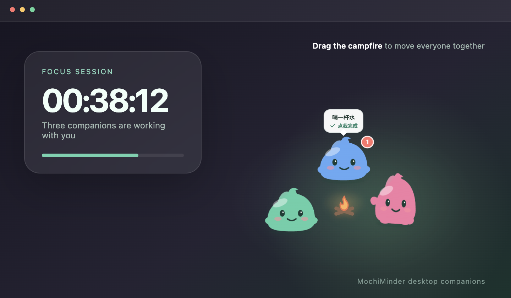

<div align="center">
  
  <h1>MochiMinder</h1>
  <p><strong>让可爱的史莱姆，温柔提醒你休息、喝水和活动身体。</strong></p>

  <p><a href="README.md">简体中文</a> · <a href="README.en.md">English</a></p>

  <p>
    <a href="https://github.com/xiangzhong26/desktopReminder/releases/latest"></a>
    
    
    <a href="LICENSE"></a>
  </p>
</div>

MochiMinder 是一款适用于 Windows 和 macOS 的开源桌面提醒工具。你可以为站立、喝水、伸展或远眺设置不同的提醒任务；开始工作后，每个任务都会化身为一只小史莱姆，在桌面上安静陪伴你。

提醒到点时，史莱姆会带着跑跳动画在屏幕上活动。点击它即可完成当前动作；没有处理的提醒会继续累积，不会悄悄消失。


## 下载

| 平台 | 安装包 | 系统要求 |
| --- | --- | --- |
| Windows | [下载 Windows x64 安装程序](https://github.com/xiangzhong26/desktopReminder/releases/latest/download/MochiMinder%20Setup%200.2.0.exe) | Windows 10/11 64 位 |
| macOS Apple Silicon | [下载 arm64 DMG](https://github.com/xiangzhong26/desktopReminder/releases/latest/download/MochiMinder-0.2.0-arm64.dmg) | M1/M2/M3/M4 Mac |
| macOS Intel | [下载 x64 DMG](https://github.com/xiangzhong26/desktopReminder/releases/latest/download/MochiMinder-0.2.0.dmg) | Intel Mac |

也可以前往 [Releases 页面](https://github.com/xiangzhong26/desktopReminder/releases/latest) 查看版本说明和全部附件。

> 当前安装包尚未使用 Apple Developer ID 或 Windows 商业代码签名证书签名。首次运行时系统可能显示安全提醒，请仅从本仓库的 Releases 页面下载安装包。

## 桌面伙伴



- 每个启用的提醒任务对应一只不同颜色的史莱姆。
- 多只史莱姆会围绕小篝火聚集；拖动篝火可整体移动它们。
- 史莱姆可以单独拖离，靠近篝火或其他史莱姆时会通过黏液拉伸动画重新吸附。
- 提醒时使用连续曲线路径移动，并带有跑跳、摆手和挤压拉伸动作。
- 待机时会呼吸、眨眼、张望或犯困，避免成为僵硬的桌面图标。
- 点击完成后会播放轻量提示音，并显示开心表情和庆祝粒子。

## 功能

### 灵活的提醒任务

- 自定义提醒内容、时间间隔和史莱姆颜色。
- 可随时启用、停用、编辑或删除任务。
- 未处理提醒会按任务独立累积。

### 工作时段统计

- 点击“开始工作”后开始记录，点击“结束工作”后停止。
- 支持一天内多次开始与结束，所有有效时段都会累计。
- 跨越午夜的工作时段会按照本地自然日正确拆分。
- 提供今日、本周、本月和累计专注时长统计。
- 记录各项习惯的累计完成次数。

### 原生桌面体验

- 透明、置顶且可拖拽的独立桌宠窗口。
- 主窗口关闭后继续在系统托盘运行。
- 支持选择开机自动启动。
- Windows 和 macOS 安装包自动构建。
- 所有个人数据仅保存在本机，不上传服务器。

## 快速开始

1. 从 [Releases](https://github.com/xiangzhong26/desktopReminder/releases/latest) 下载对应系统的安装包。
2. 安装并打开 MochiMinder。
3. 在“提醒任务”中创建需要的任务。
4. 点击“开始工作”，史莱姆伙伴便会出现在桌面上。
5. 收到提醒后点击对应史莱姆完成动作。

### macOS 首次运行

由于当前版本尚未公证，如果 macOS 阻止启动，请在 Finder 中右键点击 MochiMinder，选择“打开”，然后再次确认。不要从不可信的镜像站下载安装包。

## 本地开发

需要 Node.js 20 或更高版本。

```bash
git clone https://github.com/xiangzhong26/desktopReminder.git
cd desktopReminder
npm install
npm run dev
```

常用命令：

```bash
npm run typecheck    # TypeScript 类型检查
npm run build:web    # 构建渲染界面
npm run build:mac    # 生成 macOS DMG
npm run build:win    # 生成 Windows NSIS EXE
npm run capture:docs # 重新生成 README 效果图
```

构建产物保存在 `release/` 目录。正式分发时建议为安装包配置代码签名和 macOS 公证。

## 技术栈

- Electron：多窗口桌面运行时、系统托盘和桌宠窗口管理
- React + TypeScript：主界面与角色状态
- SVG + CSS Animation：史莱姆造型、表情和动画
- Vite：开发服务器与前端构建
- electron-builder：DMG 与 NSIS 安装包

## 数据与隐私

MochiMinder 不需要账户，也不会上传使用数据。任务、工作时段和完成记录保存在 Electron 的应用数据目录：

- macOS：`~/Library/Application Support/mochiminder/mochiminder-data.json`
- Windows：`%APPDATA%/mochiminder/mochiminder-data.json`

删除该文件会重置全部本地记录，操作前请自行备份。

## 项目结构

```text
desktopReminder/
├── electron/              # Electron 主进程和安全预加载脚本
├── src/                   # React 主界面、桌宠与样式
├── assets/                # 应用图标和安装包资源
├── docs/images/           # README 运行效果图
├── scripts/               # 文档截图工具
└── .github/workflows/     # Windows/macOS 自动构建与发布
```

## 参与贡献

欢迎提交 Issue、功能建议和 Pull Request。提交代码前请确保：

```bash
npm install
npm run typecheck
npm run build:web
```

如果修改了桌宠交互，请分别在 Windows 和 macOS 上检查透明窗口、拖拽、吸附及多显示器行为。

## 开源许可

本项目采用 [MIT License](LICENSE)。
